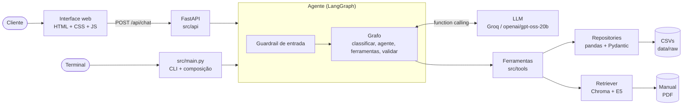
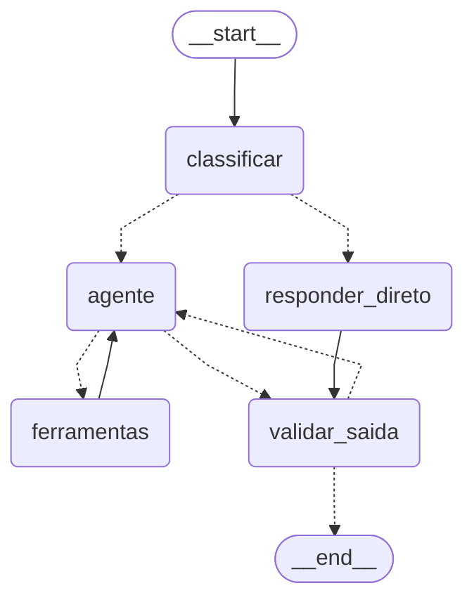
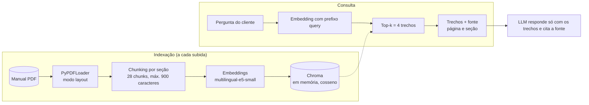

## 1. Visão geral

```mermaid
flowchart LR
    U([Cliente]) --> UI["Interface web<br/>HTML + CSS + JS"]
    UI -->|"POST /api/chat"| API["FastAPI<br/>src/api"]
    CLI([Terminal]) --> MAIN["src/main.py<br/>CLI + composição"]
    API --> AG
    MAIN --> AG

    subgraph AG["Agente (LangGraph)"]
        direction TB
        GI["Guardrail de entrada"] --> G["Grafo<br/>classificar, agente, ferramentas, validar"]
    end

    G <-->|"function calling"| LLM["LLM<br/>Groq / openai/gpt-oss-20b"]
    G --> T["Ferramentas<br/>src/tools"]

    T --> R1["Repositories<br/>pandas + Pydantic"]
    T --> R2["Retriever<br/>Chroma + E5"]
    R1 --> CSV[("CSVs<br/>data/raw")]
    R2 --> PDF[("Manual<br/>PDF")]
```

## 2. Grafo do agente (fluxo de um turno)

```mermaid
---
config:
  flowchart:
    curve: linear
---
graph TD;
        __start__([<p>__start__</p>]):::first
        classificar(classificar)
        agente(agente)
        ferramentas(ferramentas)
        responder_direto(responder_direto)
        validar_saida(validar_saida)
        __end__([<p>__end__</p>]):::last
        __start__ --> classificar;
        agente -.-> ferramentas;
        agente -.-> validar_saida;
        classificar -.-> agente;
        classificar -.-> responder_direto;
        ferramentas --> agente;
        responder_direto --> validar_saida;
        validar_saida -.-> __end__;
        validar_saida -.-> agente;
        classDef default fill:,line-height:1.2
        classDef first fill-opacity:0
        classDef last fill
```

## 3. Pipeline do RAG de políticas

```mermaid
flowchart LR
    subgraph IDX["Indexação (a cada subida)"]
        direction LR
        P[("Manual PDF")] --> L["PyPDFLoader<br/>modo layout"]
        L --> CK["Chunking por seção<br/>28 chunks, máx. 900 caracteres"]
        CK --> E["Embeddings<br/>multilingual-e5-small"]
        E --> CH[("Chroma<br/>em memória, cosseno")]
    end

    subgraph QRY["Consulta"]
        direction LR
        Q["Pergunta do cliente"] --> QE["Embedding com prefixo query"]
        QE --> S["Top-k = 4 trechos"]
        S --> O["Trechos + fonte<br/>página e seção"]
    end

    CH -.-> S
    O --> LLM["LLM responde só com os trechos e cita a fonte"]
```

